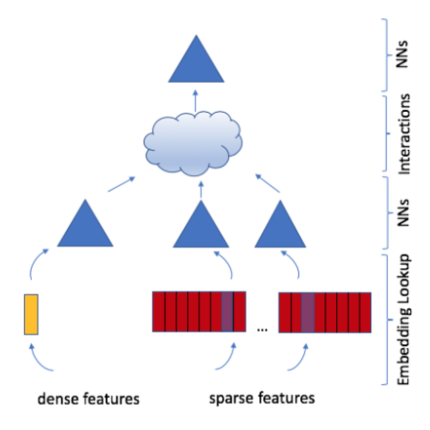
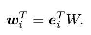
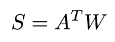

# Review: Deep Learning Recommendation Model for Personalization and Recommendation Systems
- 구현: https://github.com/facebookresearch/dlrm
- 논문: https://arxiv.org/pdf/1906.00091.pdf

## 논문 요약
### Abstract
- 뉴럴넷 기반 추천 모델들이 개인화 추천에서 중요하게 떠오른 가운데, 여러 categorical 데이터를 잘 다루어야 한다는 점에서 다른 딥러닝 네트워크와는 많이 다르다.
- SOTA 추천 알고리즘인 DLRM 제안
    - Pytorch, Caffe2로 구현

### Introduction
- 개인화와 추천에 있어 딥러닝이 활용된 연구들을 살펴보면 크게 두가지 관점으로 구분할 수 있다.
- Recommendation system 관점
    - 초기에는 몇몇의 전문가들이 상품들을 카테고리로 분류하고 유저가 선호하는 카테고리를 선택하는 방식의 content filtering 사용하였다.
	- 이것이 발전되어 과거의 유저 행동 (상품 평점 부여 등) 에 기반한 collaborative filtering 이 나오게 되었다.
	- 유저와 상품들을 그룹핑하여 추천을 제공하는 neighborhood 기법과 행렬분해를 통해 유저와 상품들 characterize하는 latent factor 기법이 추후에 나오게 되었다.
- Predictive Analysis 관점
	- 주어진 데이터로부터 데이터를 분류하거나 확률을 예측하는 통계적 모델이다.
	- 예측모델은 linear, logistic regression 정도의 간단한 모델에서 딥러닝으로 변화하였다.
	- categorical 데이터를 처리하기 위해 사용한 one-hot 또는 multi-hot 벡터를 dense representation으로 임베딩하여 사용한다.
	- 벡터 공간상에 상품 특징, 유저 특징 등을 잠재 벡터들로 표현할 수 있게 되었다.
- 본 논문에서는 위 두 가지 관점을 바탕으로 만든 개인화 모델을 소개한다.
	- 범주형 데이터인 sparse feature를 임베딩으로 처리하고, dense feature를 MLP로 처리하였다.

### Model Design and Architecture
- DLRM의 4가지 주요 기술들    
	

1. Embeddings
	- categorical 데이터를 처리하기 위해 각 카테고리를 벡터 공간 상에 dense representation 으로 매핑한다.
	- 임베딩 테이블 W가 있을 때, 각 임베딩 lookup은 one-hot 벡터 ei로 구할 수 있다.
		- i번째 아이템의 임베딩 벡터를 얻기 위해서는 단순히 i번째 위치의 값만 1이며 나머지는 0인 one-hot 벡터 ei를 W에 내적하면 된다.
		
	- 한 개의 임베딩 벡터가 아닌 여러 개의 임베딩 벡터를 lookup하는 경우에도 임베딩 테이블 W에 multi-hot 벡터 aT를 내적하면 된다.
		- aT = [0,...,ai1 ,...,aik ,...,0]
		- A = [a1,...,at]
		
	- DLRM은 categorical 데이터를 dense representation으로 매핑하기 위해 이러한 임베딩 테이블을 활용한다.
	- 이러한 임베딩이 고안되고 이를 정확한 prediction에 활용하기 위해서는 latent factor 기법을 사용할 수 있다.
	- 추가) 추천 시스템에서 임베딩을 사용하는 이유
		- NLP에서 워드 임베딩을 사용하는 이유와 동일하다.
		- 데이터 corpus를 바탕으로 word dictionary를 만들고 이를 one-hot vector로 표현하면 어떤 단어가 몇 번째 위치에 있다는 것 외에는 유의미한 정보를 얻기가 힘든데 반면, 임베딩 기법을 이용해 dense 벡터로 표현하게 되면 각 단어의 주변 단어들을 통해 해당 단어가 가지는 의미를 파악하고 표현할 수 있다.
		- 추천 시스템에서도 마찬가지고 유저, 상품, 유저 행동들을 dense representation으로 임베딩하여 categorical 데이터들의 관계적인 특징들을 파악할 수 있다.

2. Matrix Factorization
	- 임베딩 테이블에서 얻은 임베딩 벡터를 정확한 예측에 활용하기 위해서는 latent factor 기법이 필요하다.

3. Factorizatoin Machine
4. Multilayer Perceptron

#### DLRM Architecture
#### Comparison with Prior Models

### Parallelism
### Data
- Random
- Synthetic
- Public

### Experiments
### Conclusion
