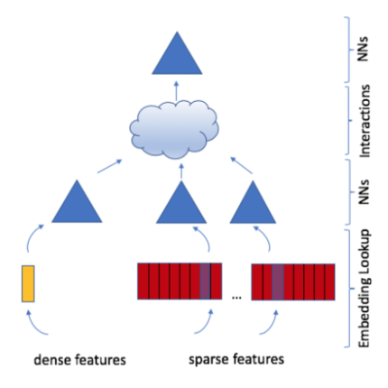
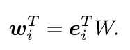
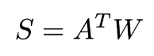
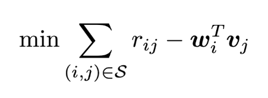
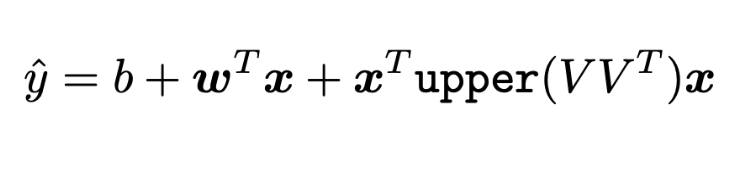
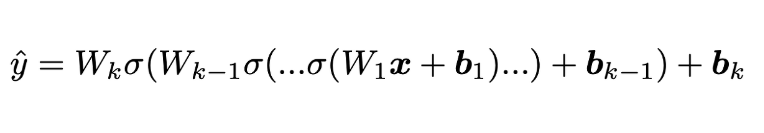
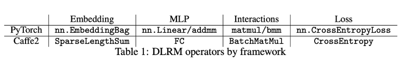

# Review: Deep Learning Recommendation Model for Personalization and Recommendation Systems
- 구현: https://github.com/facebookresearch/dlrm
- 논문: https://arxiv.org/pdf/1906.00091.pdf

## 논문 요약
### Abstract
- 뉴럴넷 기반 추천 모델들이 개인화 추천에서 중요하게 떠오른 가운데, 여러 categorical 데이터를 잘 다루어야 한다는 점에서 다른 딥러닝 네트워크와는 많이 다르다.
- SOTA 추천 알고리즘인 DLRM 제안
    - Pytorch, Caffe2로 구현

### Introduction
- 개인화와 추천에 있어 딥러닝이 활용된 연구들을 살펴보면 크게 두가지 관점으로 구분할 수 있다.
- Recommendation system 관점
    - 초기에는 몇몇의 전문가들이 상품들을 카테고리로 분류하고 유저가 선호하는 카테고리를 선택하는 방식의 content filtering 사용하였다.
	- 이것이 발전되어 과거의 유저 행동 (상품 평점 부여 등) 에 기반한 collaborative filtering 이 나오게 되었다.
	- 유저와 상품들을 그룹핑하여 추천을 제공하는 neighborhood 기법과 행렬분해를 통해 유저와 상품들 characterize하는 latent factor 기법이 추후에 나오게 되었다.
- Predictive Analysis 관점
	- 주어진 데이터로부터 데이터를 분류하거나 확률을 예측하는 통계적 모델이다.
	- 예측모델은 linear, logistic regression 정도의 간단한 모델에서 딥러닝으로 변화하였다.
	- categorical 데이터를 처리하기 위해 사용한 one-hot 또는 multi-hot 벡터를 dense representation으로 임베딩하여 사용한다.
	- 벡터 공간상에 상품 특징, 유저 특징 등을 잠재 벡터들로 표현할 수 있게 되었다.
- 본 논문에서는 위 두 가지 관점을 바탕으로 만든 개인화 모델을 소개한다.
	- 범주형 데이터인 sparse feature를 임베딩으로 처리하고, dense feature를 MLP로 처리하였다.

### Model Design and Architecture
- DLRM의 4가지 주요 기술들    
	

1. Embeddings
	- categorical 데이터를 처리하기 위해 각 카테고리를 벡터 공간 상에 dense representation 으로 매핑한다.
	- 임베딩 테이블 W가 있을 때, 각 임베딩 lookup은 one-hot 벡터 ei로 구할 수 있다.
		- i번째 아이템의 임베딩 벡터를 얻기 위해서는 단순히 i번째 위치의 값만 1이며 나머지는 0인 one-hot 벡터 ei를 W에 내적하면 된다.   
		
	- 한 개의 임베딩 벡터가 아닌 여러 개의 임베딩 벡터를 lookup하는 경우에도 임베딩 테이블 W에 multi-hot 벡터 aT를 내적하면 된다.
		- aT = [0,...,ai1 ,...,aik ,...,0]
		- A = [a1,...,at]   
		
	- DLRM은 categorical 데이터를 dense representation으로 매핑하기 위해 이러한 임베딩 테이블을 활용한다.
	- 이러한 임베딩이 고안되고 이를 정확한 prediction에 활용하기 위해서는 latent factor 기법을 사용할 수 있다.
	- **추가)** 추천 시스템에서 임베딩을 사용하는 이유
		- NLP에서 워드 임베딩을 사용하는 이유와 동일하다.
		- 데이터 corpus를 바탕으로 word dictionary를 만들고 이를 one-hot vector로 표현하면 어떤 단어가 몇 번째 위치에 있다는 것 외에는 유의미한 정보를 얻기가 힘든데 반면, 임베딩 기법을 이용해 dense 벡터로 표현하게 되면 각 단어의 주변 단어들을 통해 해당 단어가 가지는 의미를 파악하고 표현할 수 있다.
		- 추천 시스템에서도 마찬가지고 유저, 상품, 유저 행동들을 dense representation으로 임베딩하여 categorical 데이터들의 관계적인 특징들을 파악할 수 있다.

2. Matrix Factorization
	- 임베딩 테이블에서 얻은 임베딩 벡터를 정확한 예측에 활용하기 위해서는 latent factor 기법이 필요하다.
	- objective function (아래 식을 최소화하는 방향으로 학습)
		- wi: i번째 상품의 임베딩 벡터
		- vj: j번째 유저의 임베딩 벡터
		- rij: j번째 유저의 i번째 아이템에 대한 평가   
		
	- 위 식의 의미
		- NLP에서 두 단어에 대한 임베딩 벡터가 주어졌을 때, 두 벡터를 내적하여 두 단어간의 의미상 유사도를 구할 수 있다
		- 마찬가지로 i번째 상품에 대한 임베딩 벡터 wi와 j번째 유저에 대한 임베딩 벡터 vj를 내적하면 해당 상품과 유저의 연관도를 구할 수 있다.
		- 상품과 유저 간의 연관도는 곧 유저가 해당 상품을 구매할 확률, 또는 좋은 평가를 내릴 확률이라고 할 수 있다.
		- rij는 i번째 유저가 실제로 i번째 상품에 대해 평가한 true label이고, 여기에서 wi와 vj를 내적한 값을 빼면, 실제 유저의 상품 평가와 모델이 예측한 유저의 상품 평가의 오차를 구할 수 있다.
		- 이렇게 구해진 오차를 최소화하는 방향으로 학습을 하는 것이다.

3. Factorizatoin Machine
	- 일반적으로 prediction문제는 입력 데이터 x와 타겟 레이블 y 간의 매핑을 표현하는 예측 함수를 구하는 것이다.
		- 예) 클릭률을 나타내는 T={+1,-1}에서 클릭함(+1), 클릭하지 않음(-1)을 의미
	- Factorization Machine(FM)은 유저,상품 간의 이차 상호작용을 linear 모델로 추정하여 해당 상품을 클릭(또는 구매)할 확률을 예측한다.  
		
	- FM의 장점
		- SVM과는 다르게 sparse data에서도 파라미터 추정이 가능하다
			- 이차 상호작용 행렬을 matrix factorization을 이용해 잠재 요인으로 factorize하기 때문
		- Linear complexity를 가지기 때문에 효율적이다
			- 이차 상호작용의 연산을 각 임베딩 벡터 간의 연산으로 처리하여 복잡도 감소

4. Multilayer Perceptron
	- 딥러닝에서 가장 기본적인 레이어라고 할 수 있는 MLP는 fully connected layer와 활성화함수로 이루어져 있다.  
		
	- MLP는 FM을 사용하는 경우보다도 복잡한 상호작용을 파악할 때 효과적이다.
	- NCF(Neural Collaborative Filtering)에서는 내적을 통해서 임베딩 벡터 간의 상호작용을 계산하지 않고 MLP를 사용한다.

#### DLRM Architecture
- recommendation system과 predictive analytics에서 일반적으로 사용되는 모델들 4가지(Embeddings, Matrix Factorization, Factorization machine, MLP)를 살펴보았으며, DLRM은 이러한 모델들에서 사용하는 기법들을 적절히 혼합하여 만들어진 SOTA personalization 모델이다.
- 일반적으로 어떤 대상을 수로 표현하는 경우에 그 대상의 특징을 표현하는 방식은 continuous할 수도, categorical할 수도 있다.
	- Continuous feature: 가격, 나이, 연봉 등
	- Categorical feature: 성별, 연령대
- 추천시스템에서 유저와 상품을 수로 표현할 때 여러 개의 categorical & continuous feature들로 표현이 되는데, categorical 인지 continuous인지에 따라 처리하는 방식이 달라진다.
	- Categorical feature의 경우 각 feature는 동일 차원의 임베딩 벡터로 표현된다
		- matrix factorization의 latent factor 개념
	- Continuous feature의 경우 각 feature는 MLP를 통해 임베딩 벡터와 동일한 길이의 dense representation으로 변환된다.
- 위와 같은 방식으로 feature들을 처리하면 각각에 대해 임베딩 벡터와 dense representation을 얻을 수 있는데, 이 둘 간의 상호작용을 계산하기 위해 내적을 한다,
- 내적을 한 뒤에는 내적 후 얻은 결과값 벡터와 내적 이전의 dense feature들을 concat하여 MLP를 거치게 한다
- MLP를 거친 결과에 대해 sigmoid를 적용하면 최종 결과값인 유저가 상품을 클릭할 확률을 얻게 된다.
- 구현   
	

#### Comparison with Prior Models
- 많은 딥러닝 기반 추천 모델의 경우 spare feature를 처리하기 위한 방법으로 high-order term을 생성한다.
- Wide and Deep, Deep and Cross, DeepFM, xDeepFM과의 주요 차이점: embedded feature vector와 그 교차항을 처리하는 방법에 있다.
	- 위 모델들은 high-order interaction을 구성하기 위한 전문화된 네트워크를 설계한다.
	- 모델과 MLP의 결과를 합산하여 linear layer와 sigmoid 활성화를 통해 최종 확률을 산출한다.
	- DLRM은 factorization machine을 모방하는 방식으로 임베딩을 처리하여 최종 MLP의 임베딩 쌍 사이의 dot-product (not cross-product)에 의해 생성된 교차항만을 고려하여 모델의 차원을 크게 감소시킨다.
	- 특히, DLRM은 각 feature vector를 단일 범주를 나타내는 단일 단위로 해석하는 반면, Deep and Cross와 같은 네트워크는 feature vector의 각 요소를 서로 다른 교차항을 산출해내는 새로운 단위로 취급한다.